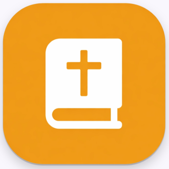
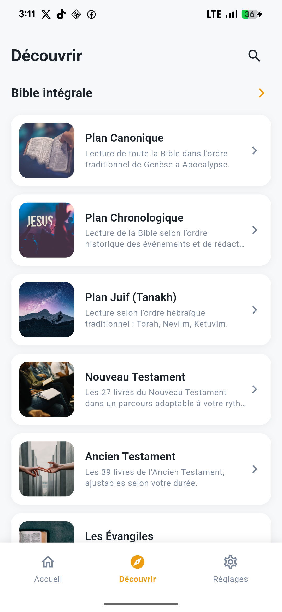
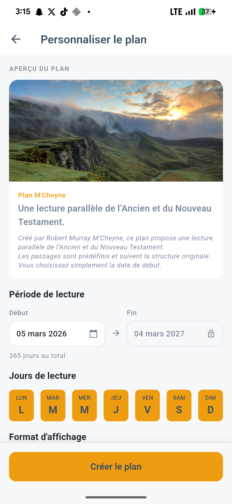
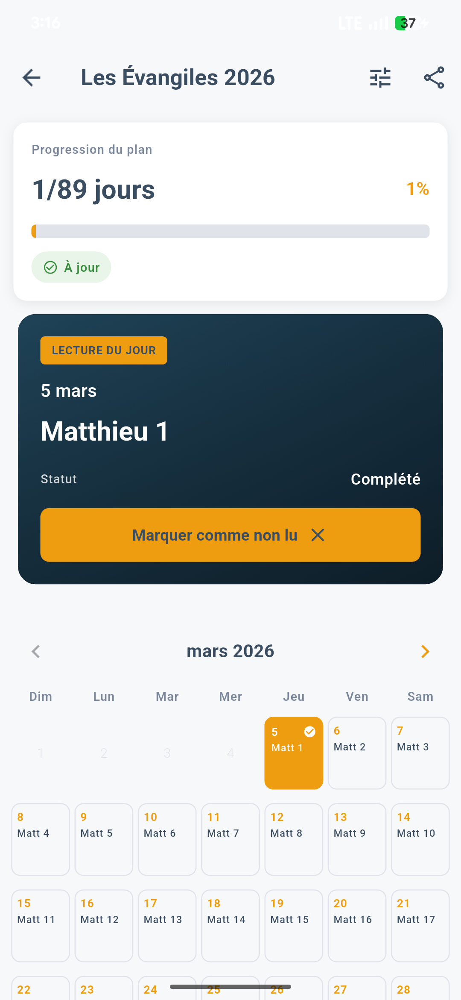
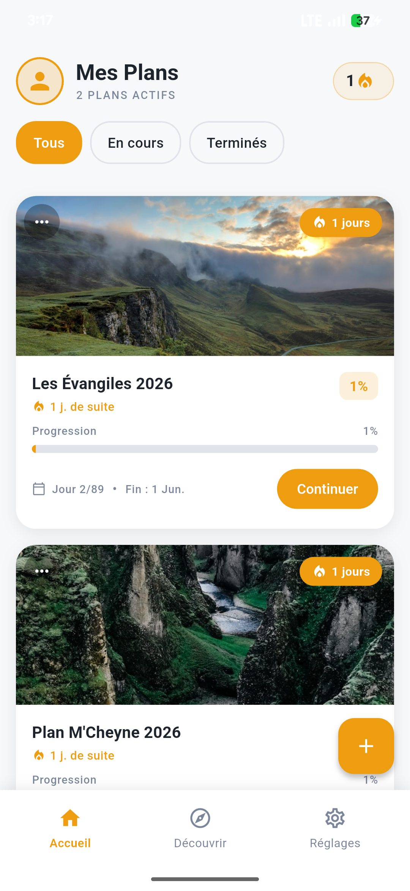
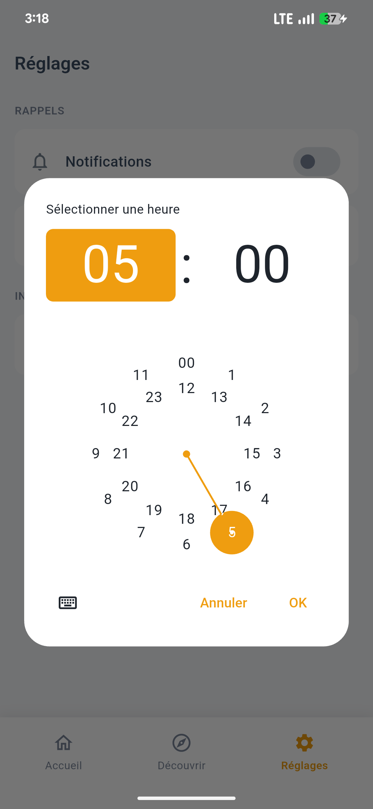
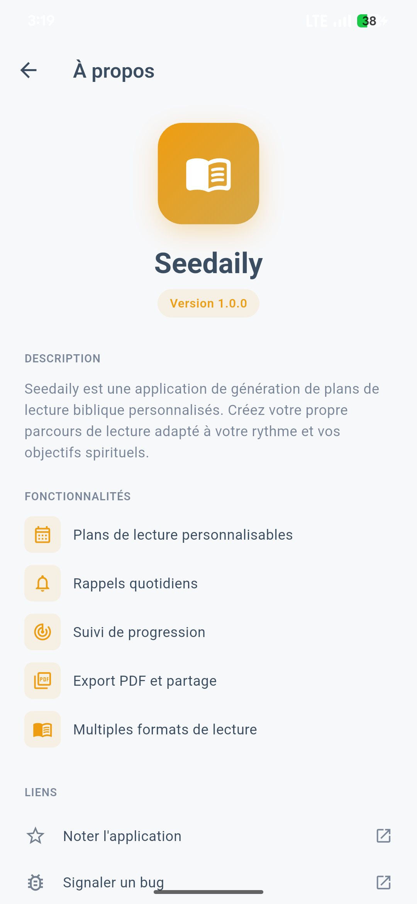

<div align="center">



# Seedaily

**Plans de lecture biblique quotidiens**

[](https://flutter.dev)
[](https://dart.dev)
[](https://flutter.dev)
[](LICENSE)

</div>

---

## Aperçu

Seedaily vous accompagne dans votre lecture quotidienne de la Bible. Choisissez un plan reconnu ou créez le vôtre, suivez votre progression jour après jour, et recevez un rappel personnalisé chaque matin.

Tout se passe **localement** — aucun compte, aucune donnée envoyée, aucune connexion requise.

---

## Captures d'écran

<div align="center">
<table>
  <tr>
    <td></td>
    <td></td>
    <td></td>
  </tr>
  <tr>
    <td></td>
    <td></td>
    <td></td>
  </tr>
</table>
</div>

---

## Fonctionnalités

- **Plans reconnus** — M'Cheyne (365j), Ligue pour la lecture de la Bible, Revolutionary (300j), Horner (5 pistes rotatives)
- **Plan personnalisé** — choisis tes livres, la durée, la distribution par chapitres ou versets
- **Suivi quotidien** — 4 vues : calendrier, liste, semaine, par livre
- **Rappels** — notification locale à l'heure de ton choix
- **Export PDF** — partage ou imprime ton plan de lecture
- **100 % hors ligne** — aucun compte, aucun serveur

---

## Stack technique

| Couche | Technologie |
|--------|-------------|
| Framework | Flutter 3 / Dart 3 |
| State management | Provider |
| Navigation | GoRouter |
| Base de données | Hive (NoSQL local) |
| Notifications | flutter_local_notifications |
| Export | pdf + printing |
| Fonts | Lexend (Google Fonts) |

---

## Installation

```bash
# Cloner le repo
git clone https://github.com/ton-username/seedaily.git
cd seedaily

# Installer les dépendances
flutter pub get

# Lancer en debug
flutter run

# Builder une release Android
flutter build appbundle --release
```

---

## Structure du projet

```
lib/
├── domain/
│   ├── models.dart           # Modèles de données (Plan, ReadingDay…)
│   └── bible_data.dart       # Données des livres bibliques
├── services/
│   ├── plan_generator.dart   # Génération des plans
│   ├── storage_service.dart  # Persistence Hive
│   ├── notification_service.dart
│   └── export_service.dart   # Export PDF
├── providers/
│   ├── plans_provider.dart
│   └── settings_provider.dart
├── ui/
│   ├── screens/
│   └── widgets/
└── main.dart
```

---

## Confidentialité

Seedaily ne collecte aucune donnée personnelle. Toutes les informations sont stockées localement sur votre appareil.

→ [Politique de confidentialité](PRIVACY_POLICY.md)

---

<div align="center">

Fait avec ☕ et Flutter

</div>