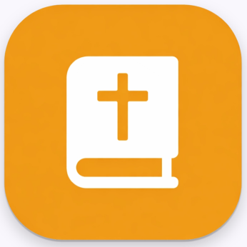
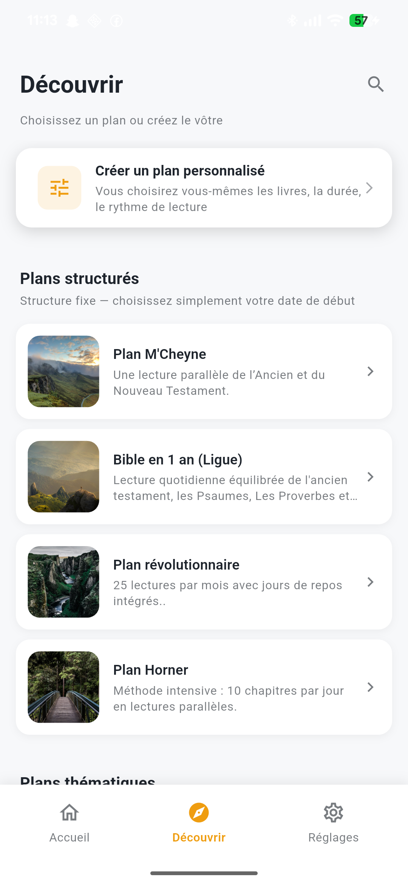
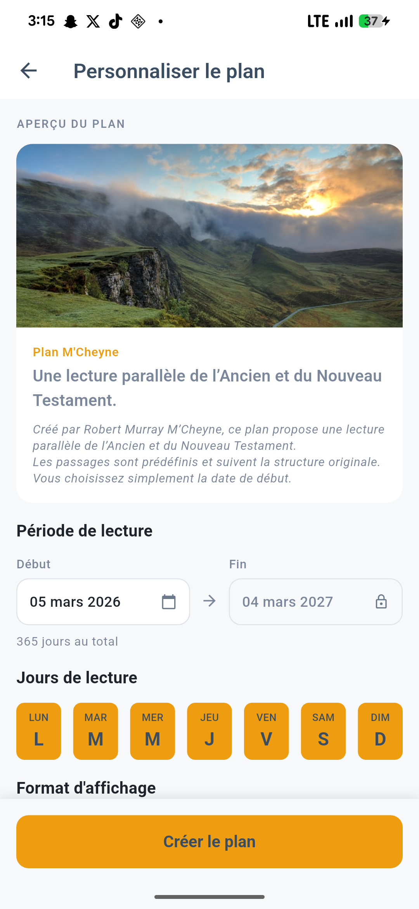
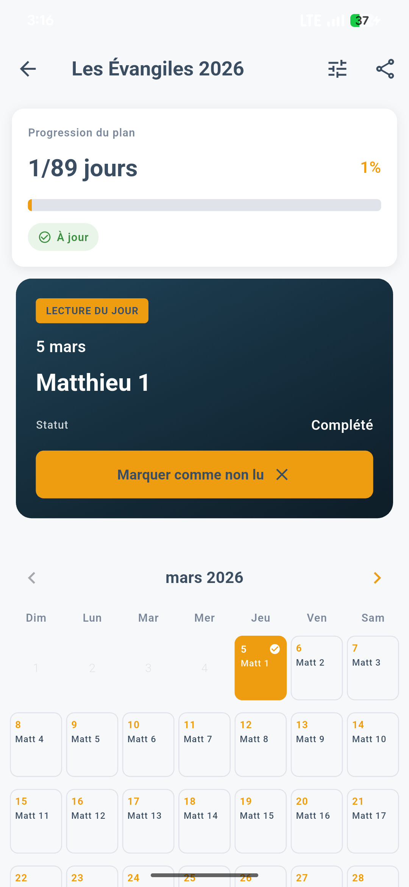
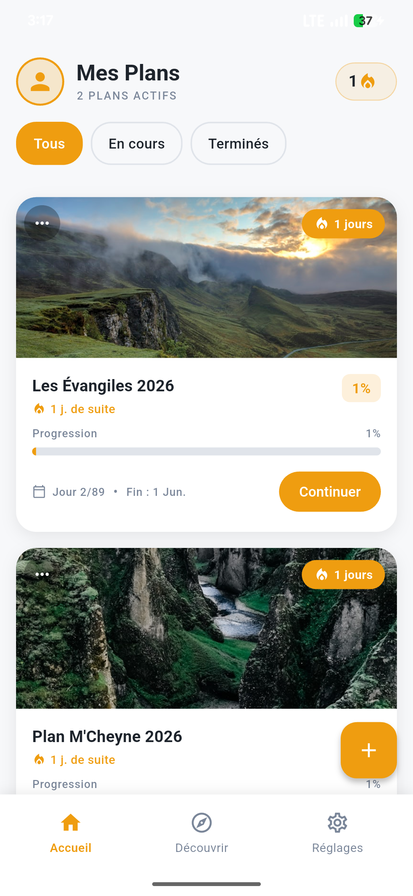
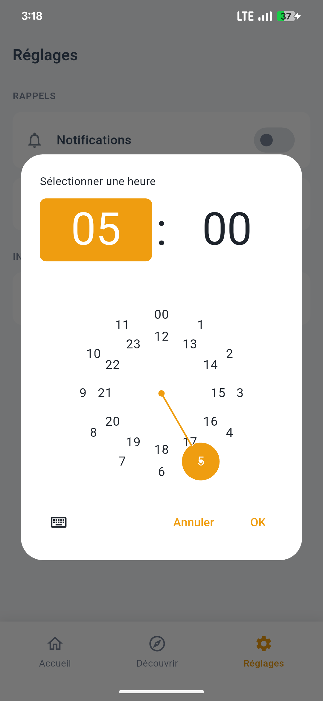
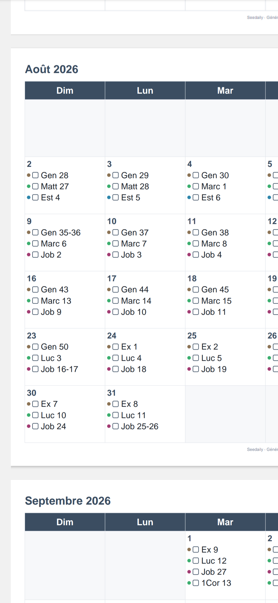

<div align="center">



# Seedaily

**Plans de lecture biblique quotidiens**

[](https://flutter.dev)
[](https://dart.dev)
[](https://flutter.dev)
[](LICENSE)

</div>

---

## Aperçu

Seedaily vous accompagne dans votre lecture quotidienne de la Bible. Choisissez un plan reconnu ou créez le vôtre, suivez votre progression jour après jour, et recevez un rappel personnalisé chaque matin.

Tout se passe **localement** — aucun compte, aucune donnée envoyée, aucune connexion requise.

---

## Captures d'écran

<div align="center">
<table>
  <tr>
    <td></td>
    <td></td>
    <td></td>
  </tr>
  <tr>
    <td></td>
    <td></td>
    <td></td>
  </tr>
</table>
</div>

---

## Fonctionnalités

### Plans disponibles
- **4 plans structurés** — M'Cheyne (365j), Ligue pour la lecture de la Bible (365j), Revolutionary (300j), Horner (10 listes en rotation continue)
- **5 plans thématiques** — Nouveau Testament, Ancien Testament, Évangiles, Psaumes, Proverbes
- **2 plans personnalisés** — ordre canonique ou chronologique, livres au choix

### Personnalisation
- Sélection individuelle des livres (AT / NT / Deutérocanoniques)
- Réorganisation visuelle selon l'ordre choisi (canonique, chronologique, hébreu)
- Durée par **date de fin** ou par **nombre de chapitres par jour** (calcul automatique)
- Raccourcis de période : 15 j · 1 mois · 45 j · 3 mois · 6 mois · 1 an
- Psaumes et Proverbes quotidiens, alternance AT/NT, lecture inversée

### Suivi & navigation
- **4 vues** — calendrier mensuel, liste, semaine (avec photo), par livre
- Progression en % · streak · statut (en avance / dans les temps / en retard)
- Recherche rapide parmi les plans disponibles

### Autres
- **Rappels** — notification locale à l'heure de ton choix
- **Export PDF** — calendrier A4 paysage avec options : couleurs par genre biblique, cases à cocher pour lecture sur papier
- **100 % hors ligne** — aucun compte, aucun serveur

---

## Stack technique

| Couche | Technologie |
|--------|-------------|
| Framework | Flutter 3 / Dart 3 |
| State management | Provider |
| Navigation | GoRouter |
| Base de données | Hive (NoSQL local) |
| Notifications | flutter_local_notifications |
| Export | pdf + printing |
| Fonts | Lexend (Google Fonts) |

---

## Installation

```bash
# Cloner le repo
git clone https://github.com/ton-username/seedaily.git
cd seedaily

# Installer les dépendances
flutter pub get

# Lancer en debug
flutter run

# Builder une release Android
flutter build appbundle --release
```

---

## Structure du projet

```
lib/
├── domain/
│   ├── models.dart           # Modèles de données (Plan, ReadingDay…)
│   └── bible_data.dart       # Données des livres bibliques
├── services/
│   ├── plan_generator.dart   # Génération des plans
│   ├── storage_service.dart  # Persistence Hive
│   ├── notification_service.dart
│   └── export_service.dart   # Export PDF
├── providers/
│   ├── plans_provider.dart
│   └── settings_provider.dart
├── ui/
│   ├── screens/
│   └── widgets/
└── main.dart
```

---

## Confidentialité

Seedaily ne collecte aucune donnée personnelle. Toutes les informations sont stockées localement sur votre appareil.

→ [Politique de confidentialité](PRIVACY_POLICY.md)

---

<div align="center">

Fait avec ☕ et Flutter

</div>